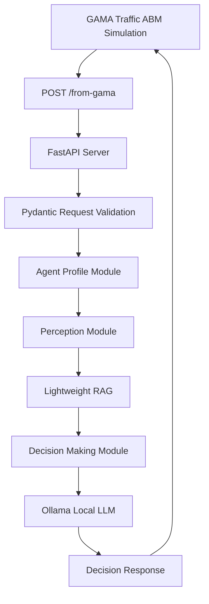

# LLM ABM Model Server

FastAPI-based LLM decision server for GAMA agent-based traffic simulation.

本專案是一個提供 GAMA 交通 ABM 模擬模型呼叫的 LLM core server。GAMA 透過 HTTP request 傳送模擬狀態，Python FastAPI server 依序執行 agent profile、perception、decision making 與 lightweight RAG 流程，再將決策結果回傳給 GAMA 使用。

## Project Overview

`LLM_abm_model` 的目標是把傳統 agent-based model 的模擬狀態，轉換成可供 LLM 推理的上下文，讓 agent 的移動決策能納入個體特徵、環境感知、交通狀態與歷史記憶。

核心整合重點：

- GAMA 作為交通模擬與 agent-based modeling client。
- FastAPI 作為 GAMA 與 Python LLM pipeline 之間的 HTTP bridge。
- Ollama 作為本機 LLM inference backend。
- Prompt engineering 管理 agent profile、perception 與 decision making。
- TF-IDF cosine similarity 提供 lightweight RAG context retrieval。
- OD converter 支援將自然語言或 JSON 行程轉換為 OD CSV。

## Architecture



### Request Flow

1. GAMA sends simulation state to `POST /from-gama`.
2. FastAPI validates the request with Pydantic models.
3. The server loads or generates the agent profile.
4. The perception module combines prompt templates with the GAMA state.
5. The decision-making module retrieves relevant perception context through lightweight RAG.
6. The server returns the LLM decision result to GAMA.

## Project Structure

```text
LLM_abm_model/
├─ server.py                         # FastAPI entrypoint and /from-gama endpoint
├─ llm_config.py                     # Ollama environment configuration
├─ agent_profile.py                  # Agent profile generation pipeline
├─ perception.py                     # GAMA state perception pipeline
├─ decision_making.py                # Decision-making pipeline
├─ RAG.py                            # Lightweight TF-IDF RAG utility
├─ od_converter.py                   # OD CSV conversion utility
├─ output_engine.py                  # UTF-8 output writer
├─ timer.py                          # Ollama request timing helper
├─ schemas/
│  └─ agentprofile_schema.py         # Agent profile Pydantic schema
├─ prompts/
│  ├─ system_prompt.txt
│  ├─ agentprofile_prompt.txt
│  ├─ perception_prompt.txt
│  └─ decision_making_prompt.txt
├─ gama_moudle/                      # GAMA model and API POST module
├─ GIS data/                         # GIS input data for the simulation
├─ docs/                             # Architecture and integration notes
├─ examples/                         # Example GAMA payloads and sample outputs
└─ output/                           # Local generated outputs, ignored by Git
```

> Note: `gama_moudle/` is kept as-is to avoid breaking existing local paths. A future cleanup can rename it to `gama_module/` in a dedicated migration commit.

## Requirements

- Python 3.12 was used in the local virtual environment during review.
- Ollama running locally or on a reachable host.
- GAMA Platform for running the ABM simulation.
- Python dependencies listed in `requirements.txt`.

Install dependencies:

```bash
python -m venv .venv
.\.venv\Scripts\activate
python -m pip install -r requirements.txt
```

## Environment Variables

Create a local `.env` file based on `.env.example`:

```env
OLLAMA_URL=http://127.0.0.1:11434
OLLAMA_MODE=/api/generate
OLLAMA_MODEL=gpt-oss:20b
```

`.env` is intentionally ignored by Git and should not be uploaded.

## How to Run

Start the FastAPI server:

```bash
uvicorn server:app --host 127.0.0.1 --port 8000 --reload
```

The GAMA model can then post simulation payloads to:

```text
http://127.0.0.1:8000/from-gama
```

## API

### `POST /from-gama`

Receives simulation state from GAMA and returns the LLM decision result.

Supported payload patterns:

- Initialization payload with `requested_agents`.
- Step update payload with `agents_status`.
- Compatibility payload with `agents`.

Minimal example:

```json
{
  "request_type": "step_update",
  "model": "TrafficABM_Tainan_LLM",
  "cycle": 1,
  "agents_status": [
    {
      "agent_id": "vehicle_001",
      "origin_town": "佳里區",
      "destination_town": "安南區",
      "memory": []
    }
  ],
  "environment": {}
}
```

More examples are available in `examples/`.

## GAMA Integration

The GAMA modules under `gama_moudle/` define the HTTP client settings:

- Host: `127.0.0.1`
- Port: `8000`
- Endpoint: `/from-gama`
- Method: `POST`

See `docs/GAMA_INTEGRATION.md` for the request lifecycle and payload notes.

## Data and Outputs

- `GIS data/` contains the spatial data used by the GAMA traffic model. Keep source, coordinate system, and license information documented before publishing publicly.
- `output/` contains generated LLM outputs and is ignored by Git to keep the repository clean.
- `examples/sample_outputs/` contains selected sample outputs for portfolio review.

## Limitations

- The current LLM backend assumes an Ollama-compatible API.
- LLM responses may vary depending on model, prompt, temperature, and local runtime.
- The server is designed for local research and portfolio demonstration, not production deployment.
- Further work is needed to enforce strict JSON response contracts for all LLM outputs.

## Future Work

- Add unit tests for `RAG.py`, `od_converter.py`, and request schema validation.
- Add GitHub Actions for syntax check and lightweight tests.
- Introduce structured JSON output validation for LLM responses.
- Package the project under `src/` after API contracts stabilize.
- Rename `gama_moudle/` to `gama_module/` in a dedicated compatibility-safe commit.

## License and Citation

Before publishing, confirm the license requirements for all GIS data and GAMA model assets. If this repository is used in an academic context, add the related project citation or thesis reference here.
