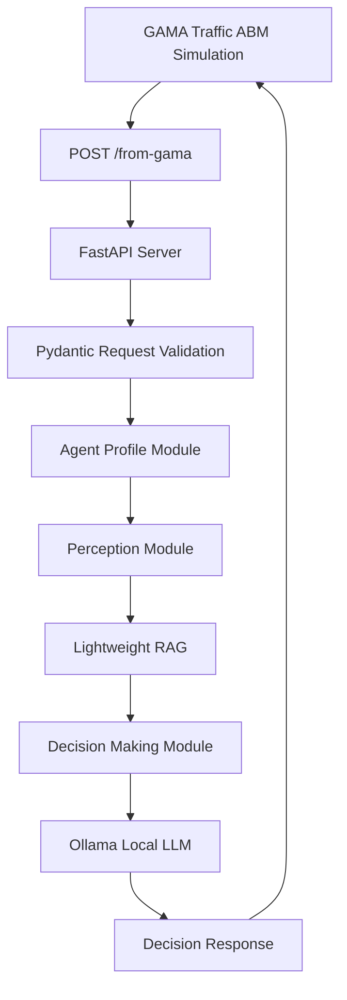

# LLM ABM Model Server

FastAPI-based LLM decision server for GAMA agent-based traffic simulation.

## Overview

`LLM_abm_model` is a local backend service that connects a GAMA agent-based traffic simulation with an LLM reasoning pipeline. GAMA sends simulation states to a FastAPI endpoint, and the Python server transforms those states into agent profiles, perception context, retrieved evidence, and decision-making prompts before returning an LLM-generated decision response.

This project is designed as a research prototype and portfolio project that demonstrates the integration of:

- Agent-based traffic simulation with GAMA.
- A FastAPI HTTP bridge for simulation-to-LLM communication.
- Local LLM inference through an Ollama-compatible API.
- Prompt engineering for agent profile, perception, and decision-making tasks.
- Lightweight retrieval-augmented generation using TF-IDF and cosine similarity.
- OD conversion utilities for turning structured or natural-language trip plans into CSV records.

## Motivation

Traditional agent-based models often rely on fixed rules or predefined behavior parameters. This project explores how local LLM reasoning can be introduced into a simulation loop so that agents can make context-aware decisions based on identity, travel memory, environmental perception, congestion signals, and scenario-specific prompts.

The main goal is not to build a production traffic system, but to demonstrate a working architecture for combining GAMA, FastAPI, local LLM inference, and modular ABM decision logic.

## Architecture



## Request Flow

1. GAMA sends an initialization or step-update payload to `POST /from-gama`.
2. FastAPI validates the request with Pydantic models.
3. The server loads or generates agent profile data.
4. The perception module combines prompt templates with the current GAMA state.
5. The decision-making module retrieves relevant perception context through lightweight RAG.
6. The Ollama-compatible LLM endpoint generates a decision response.
7. The server returns the decision result to GAMA.

## Features

- `POST /from-gama` endpoint for GAMA integration.
- Request schema compatibility for `requested_agents`, `agents_status`, and legacy `agents` payloads.
- Modular LLM pipeline with separate agent profile, perception, and decision-making stages.
- Prompt files stored separately under `prompts/` for easier iteration.
- Lightweight TF-IDF retrieval for selecting relevant perception context.
- OD CSV conversion utility for downstream traffic analysis workflows.
- Curated example payloads and sample outputs for GitHub portfolio review.
- GitHub Actions syntax check for basic repository hygiene.

## Project Structure

```text
LLM_abm_model/
├─ server.py                         # FastAPI entrypoint and /from-gama endpoint
├─ llm_config.py                     # Ollama environment configuration
├─ agent_profile.py                  # Agent profile generation pipeline
├─ perception.py                     # GAMA state perception pipeline
├─ decision_making.py                # Decision-making pipeline
├─ RAG.py                            # Lightweight TF-IDF RAG utility
├─ od_converter.py                   # OD CSV conversion utility
├─ output_engine.py                  # UTF-8 output writer
├─ timer.py                          # Ollama request timing helper
├─ schemas/
│  └─ agentprofile_schema.py         # Agent profile Pydantic schema
├─ prompts/
│  ├─ system_prompt.txt
│  ├─ agentprofile_prompt.txt
│  ├─ perception_prompt.txt
│  └─ decision_making_prompt.txt
├─ gama_moudle/                      # GAMA model and API POST module
├─ GIS data/                         # GIS input data for the simulation
├─ docs/                             # Architecture and integration notes
├─ examples/                         # Example GAMA payloads and sample outputs
└─ output/                           # Local generated outputs, ignored by Git
```

`gama_moudle/` is intentionally kept with its current name to avoid breaking existing local GAMA paths. A future cleanup can rename it to `gama_module/` in a dedicated migration commit.

## Requirements

- Python 3.12 or later is recommended.
- Ollama or an Ollama-compatible local LLM API.
- GAMA Platform for running the ABM simulation.
- Python dependencies listed in `requirements.txt`.

## Installation

Create and activate a virtual environment:

```bash
python -m venv .venv
```

On Windows PowerShell:

```powershell
.\.venv\Scripts\Activate.ps1
```

Install dependencies:

```bash
python -m pip install -r requirements.txt
```

## Environment Variables

Create a local `.env` file based on `.env.example`:

```env
OLLAMA_URL=http://127.0.0.1:11434
OLLAMA_MODE=/api/generate
OLLAMA_MODEL=gpt-oss:20b
```

`.env` is intentionally ignored by Git and should not be committed.

## Running the Server

Start the FastAPI server:

```bash
uvicorn server:app --host 127.0.0.1 --port 8000 --reload
```

The GAMA model can then post simulation payloads to:

```text
http://127.0.0.1:8000/from-gama
```

## API

### `POST /from-gama`

Receives simulation state from GAMA and returns the LLM decision result.

Supported payload patterns:

- Initialization payload with `requested_agents`.
- Step-update payload with `agents_status`.
- Compatibility payload with `agents`.

Example step-update payload:

```json
{
  "request_type": "step_update",
  "model": "TrafficABM_Tainan_LLM",
  "cycle": 1,
  "agents_status": [
    {
      "agent_id": "vehicle_001",
      "origin_town": "Jiali District",
      "destination_town": "Annan District",
      "memory": []
    }
  ],
  "environment": {}
}
```

More examples are available in `examples/`.

## GAMA Integration

The GAMA modules under `gama_moudle/` define the HTTP client settings used to call the Python server:

| Setting | Value |
| --- | --- |
| Host | `127.0.0.1` |
| Port | `8000` |
| Endpoint | `/from-gama` |
| Method | `POST` |

See `docs/GAMA_INTEGRATION.md` for the request lifecycle and payload compatibility notes.

## Documentation

- `docs/ARCHITECTURE.md`: System architecture and module responsibilities.
- `docs/API.md`: API payload patterns and endpoint reference.
- `docs/GAMA_INTEGRATION.md`: GAMA request lifecycle and integration notes.
- `docs/DATA.md`: GIS data and output versioning policy.

## Examples

The `examples/` directory contains:

- `gama_request_init.json`: Example initialization payload.
- `gama_request_step.json`: Example step-update payload.
- `sample_outputs/`: Selected outputs from local LLM runs for portfolio review.

The full local `output/` directory is ignored by Git because it contains generated runtime artifacts.

## Data and Output Policy

- `GIS data/` contains spatial input data used by the GAMA traffic model. Before public reuse, verify the original data source, coordinate system, attribution requirements, and redistribution terms.
- `output/` contains generated LLM outputs and is ignored by Git to keep the repository focused on source code and curated examples.
- `examples/sample_outputs/` contains selected representative outputs for review.

## Validation

Basic local validation commands:

```bash
python -m compileall -q -x "(\.venv|__pycache__|output)" .
```

```bash
python -c "from pathlib import Path; from server import GamaRequest; [GamaRequest.model_validate_json(Path(p).read_text(encoding='utf-8')) for p in ['examples/gama_request_init.json','examples/gama_request_step.json']]; print('GamaRequest examples validated')"
```

Full integration testing requires both GAMA and Ollama to be running.

## Limitations

- The current LLM backend assumes an Ollama-compatible API.
- LLM responses may vary depending on model, prompt, temperature, and runtime settings.
- The current response contract is prompt-driven and should be strengthened with strict JSON validation in future work.
- This repository is designed for local research and portfolio demonstration, not production deployment.

## Future Work

- Add unit tests for `RAG.py`, `od_converter.py`, and request schema validation.
- Add stricter JSON schema validation for LLM responses.
- Expand GitHub Actions from syntax checks to unit tests.
- Package the project under `src/` after API contracts stabilize.
- Rename `gama_moudle/` to `gama_module/` in a compatibility-safe migration commit.

## License

Unless otherwise noted, the source code, documentation, prompts, and curated examples in this repository are licensed under the MIT License. See `LICENSE` for details.

GIS files under `GIS data/` are provided for simulation context and remain subject to their original data source licenses. Verify the original source, attribution requirements, and redistribution terms before reuse.

## Citation

If this repository is used in an academic context, add the related project citation, thesis reference, or research acknowledgement here.
