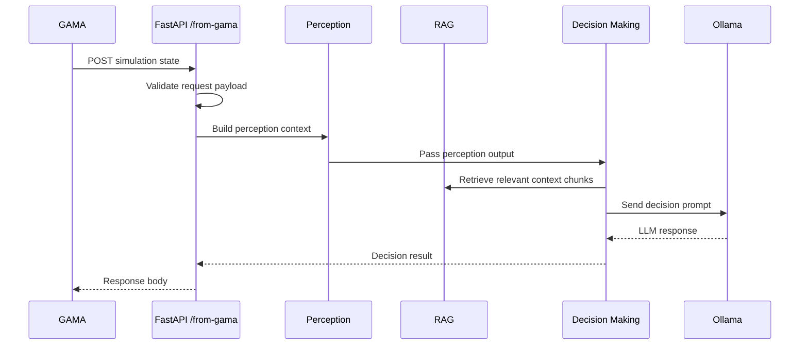

# Architecture

This document describes the high-level architecture of `LLM_abm_model`.

## System Role

`LLM_abm_model` acts as a local LLM decision server for a GAMA traffic ABM simulation. GAMA owns the simulation state and sends HTTP payloads to FastAPI. Python modules transform the simulation state into LLM prompts, retrieve relevant context, call Ollama, and return the decision result.

## Module Responsibilities

| Module | Responsibility |
| --- | --- |
| `server.py` | FastAPI app, request schema, `/from-gama` endpoint |
| `llm_config.py` | Loads Ollama connection settings from `.env` |
| `agent_profile.py` | Generates or loads agent profile information |
| `perception.py` | Converts GAMA state into LLM-readable perception context |
| `decision_making.py` | Builds the decision prompt and calls the LLM |
| `RAG.py` | Selects relevant perception chunks with TF-IDF cosine similarity |
| `od_converter.py` | Converts JSON or natural-language itinerary data into OD CSV rows |
| `output_engine.py` | Writes generated outputs as UTF-8 text files |
| `timer.py` | Logs long-running Ollama request timing |

## Data Flow

## Runtime Assumptions

- FastAPI runs locally at `127.0.0.1:8000`.
- Ollama exposes an API such as `http://127.0.0.1:11434/api/generate`.
- GAMA sends initialization and step-update payloads through HTTP POST.
- Generated outputs are local runtime artifacts and should not be committed except curated samples.

## Portfolio Presentation Notes

For GitHub review, the repository should highlight:

- The integration boundary between GAMA and Python.
- The LLM pipeline stages.
- The prompt files as explicit reasoning templates.
- The GIS and GAMA assets as simulation context.
- Sample requests and outputs without uploading large or repetitive runtime logs.
